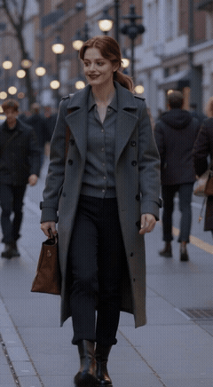
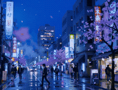

# 🎬 创意视频综合套件 (FreeVideoSkill)

> 一个综合视频创作全流程 Skill，支持短剧/剧情视频和通用商业视频两大类视频生成。  
> 内置 Agnes AI 免费API，零成本即可开始创作。

---

## ✨ 核心优势

### 🆓 完全免费，零门槛上手

- **免费 API**：内置 Agnes AI 视频生成 API，目前无限期免费开放，无需付费即可生成视频
- **一键安装**：作为 QClaw Skill 即装即用，无需复杂的环境配置
- **免费模型矩阵**：文本(`agnes-2.0-flash`)、文生图(`agnes-image-2.1-flash`，最高4K)、图生图(`agnes-image-2.0-flash`)、视频(`agnes-video-v2.0`)全部免费

### 🎭 两大创作分支，覆盖主流视频场景

| 分支 | 适用场景 |
|---|---|
| **短剧/剧情视频** | 短剧、动画、微电影、剧情视频、影视化、动态漫、预告片 |
| **商业视频** | 产品广告、UGC口播、带货视频、企业宣传、品牌形象片 |

### 🔄 全流程覆盖，从剧本到成片

不需要多个工具来回切换，一个 Skill 搞定完整视频生产链：

- **剧本创作** → 故事构思、角色设定、剧情发展
- **分镜设计** → 镜头语言、节奏控制、画面描述
- **资产设定** → 角色、场景、道具的视觉设定
- **关键帧生成** → 基于分镜的关键画面
- **视频生成** → 最终视频输出

### 🧠 智能工作流，专业级质量控制

- **参数门禁**：生成前必须确认时长、比例、内容、数量，避免无效生成
- **即时输出**：每生成完一张图或一个视频立即展示，不批量等待
- **质量审查**：自动检查人设图正脸一致性、关键帧与剧情匹配度
- **分镜叙事**：支持多镜头连续叙事，可生成30秒+剧情视频

### 🛠️ 开发者友好

- 提供 Python 客户端类 `AgnesAIClient`，可直接集成到自己的项目
- 提供命令行工具 `generate_with_agnes.py`，快速生成图像/视频
- OpenAI 兼容接口，方便迁移现有代码
- 完整的 API 文档和参考示例

---

## 📁 目录结构

```
FreeVideoSkill/
├── SKILL.md                          # Skill 主入口
├── README.md                         # 项目说明
├── examples/                         # 示例视频
│   ├── README.md                     # 示例说明
│   ├── 01_ocean_sunset.mp4           # 风景类文生视频示例
│   ├── 01_ocean_sunset_preview.gif   # 风景类预览GIF
│   ├── 02_city_walk.mp4              # 人物类文生视频示例
│   ├── 02_city_walk_preview.gif      # 人物类预览GIF
│   ├── final_manga_30s.mp4           # AI动漫漫剧示例（30秒）
│   └── final_manga_30s_preview.gif   # 动漫漫剧预览GIF
├── references/
│   ├── drama/                        # 短剧/剧情视频分支
│   │   ├── scriptwriter.md           # 剧本创作
│   │   ├── storyboard.md             # 分镜切分
│   │   ├── assets.md                 # 资产设定
│   │   ├── frame.md                  # 关键帧生成
│   │   └── prompt.md                 # 视频提示词
│   ├── commercial/                   # 商业视频分支
│   │   ├── ugc-talking-video-ref.md      # UGC口播视频
│   │   ├── product-marketing-ad-video-no-storyboard-ref.md  # 产品营销广告
│   │   └── corporate-business-video-ref.md  # 企业商务宣传
│   └── agnes-ai-api.md               # Agnes AI API 文档
└── scripts/
    ├── agnes_ai_client.py            # Agnes AI Python 客户端
    └── generate_with_agnes.py        # 便捷命令行工具
```

---

## 🚀 快速开始

### 1. 安装 Skill

将本仓库下载到 QClaw 的 skills 目录：

```bash
# 克隆仓库
git clone https://github.com/vvlife/FreeVideoSkill.git ~/.qclaw/skills/FreeVideoSkill
```

### 2. 配置 Agnes AI（免费）

1. 访问 [Agnes AI 控制台](https://platform.agnes-ai.com) 注册账号
2. 获取 API Key
3. 设置环境变量：

```bash
export AGNES_API_KEY="your-api-key"
```

### 3. 开始创作

直接在 QClaw 中用自然语言描述你的需求即可，例如：

> "帮我做一个30秒的动漫短剧，故事是关于一个女孩在雨夜错过了最后一班地铁……"

Skill 会自动完成剧本创作 → 分镜设计 → 资产设定 → 关键帧生成 → 视频生成的全流程。

### 4. 使用命令行工具（可选）

```bash
# 文生图
python scripts/generate_with_agnes.py image -p "一只可爱的猫" -s 1024x1024

# 图生图
python scripts/generate_with_agnes.py image -p "改成赛博朋克风格" -r https://example.com/img.png

# 文生视频（10秒）
python scripts/generate_with_agnes.py video -p "海边日落" --duration 10

# 图生视频
python scripts/generate_with_agnes.py video -p "人物慢慢转头" -i https://example.com/frame.png

# 生成角色设定图
python scripts/generate_with_agnes.py character -n "小明" -d "年轻男性，黑色短发" --style "真人电影"
```

### 5. 使用 Python 客户端（可选）

```python
from scripts.agnes_ai_client import AgnesAIClient

client = AgnesAIClient(api_key="your-api-key")

# 文本生成
result = client.chat("用一句话介绍你自己")

# 文生图
image_url = client.text_to_image(
    "A beautiful sunset over the ocean",
    size="1024x768"
)

# 视频生成
video_url = client.generate_video(
    "A peaceful ocean sunset with gentle waves",
    height=768,
    width=1152,
    num_frames=121,
    frame_rate=24,
)
```

---

## 📋 核心规则

### 视频生成门禁

生成视频前必须确认四个要素：
- **时长**：视频长度
- **比例**：画面比例（16:9、9:16、1:1 等）
- **详细内容**：画面主体、动作、场景、风格
- **数量**：一次最多 2 个

### 确认机制

必须输出参数摘要并等待用户明确确认后才能生成。

### 即时输出原则

每生成完一张图或一个视频，立即展示返回，不批量打包。

### 图片质量审查

- 人设图：面部正脸、三视图一致
- 关键帧：剧情匹配、人物场景道具一致

---

## 🎥 示例视频

本目录包含使用本 Skill 生成的示例视频，展示不同类型的视频创作效果。点击预览图即可播放完整视频。

### 01_ocean_sunset.mp4 — 风景类（文生视频）

**类型**：风景/自然 | **比例**：16:9（横屏） | **时长**：约 5 秒 | **分辨率**：1280x704

**Prompt**：`A cinematic shot of a beautiful sunset over the ocean, golden hour light, gentle waves, seagulls flying, slow camera pan, movie still quality, 4K`

[](examples/01_ocean_sunset.mp4)

---

### 02_city_walk.mp4 — 人物类（文生视频）

**类型**：人物/街拍 | **比例**：9:16（竖屏） | **时长**：约 5 秒 | **分辨率**：704x1280

**Prompt**：`A young woman walking down a city street at dusk, wearing a stylish coat, cinematic lighting, slow motion, shallow depth of field, movie still quality`

[](examples/02_city_walk.mp4)

---

### 03_final_manga_30s.mp4 — AI动漫漫剧 ·《最后一班地铁》

**类型**：AI动漫/叙事漫剧 | **比例**：4:3 | **时长**：30秒 | **分辨率**：720p（1088×832）| **帧率**：24fps  
**模型**：Agnes AI Video (`agnes-video-v2.0`) | **分镜**：6个镜头连续叙事  
**提示词示例**：
> Anime style young woman walking alone into a subway station entrance at night, long staircase with soft warm lighting, her slender silhouette descending, cinematic atmosphere, Japanese anime aesthetic, lonely mood

**故事简介**：雨夜，一位疲惫的年轻女性走进地铁站，发现末班车已离开。一位神秘的陌生人悄悄为她撑起一把伞……

**预览（点击 GIF 跳转播放器观看完整 30 秒视频）**：

[](examples/final_manga_30s.mp4)

---

## 📄 License

MIT License - 可自由使用、修改、分发。

## 🔗 相关链接

- [Agnes AI 官网](https://platform.agnes-ai.com)
- [QClaw 官网](https://qclaw.ai)
- [问题反馈](https://github.com/vvlife/FreeVideoSkill/issues)
